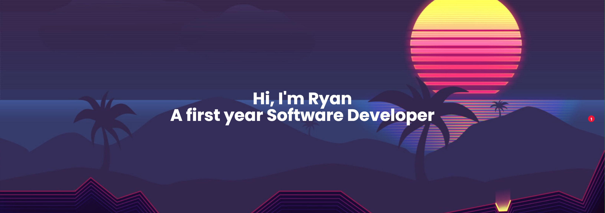

 

 

---

<h2 align="center">Tech Stack</h2>

**Languages**

**Cloud & Infrastructure**

**Observability & Data**

---

<h2 align="center">GitHub Stats</h2>

---

<h2 align="center">Featured Projects</h2>

